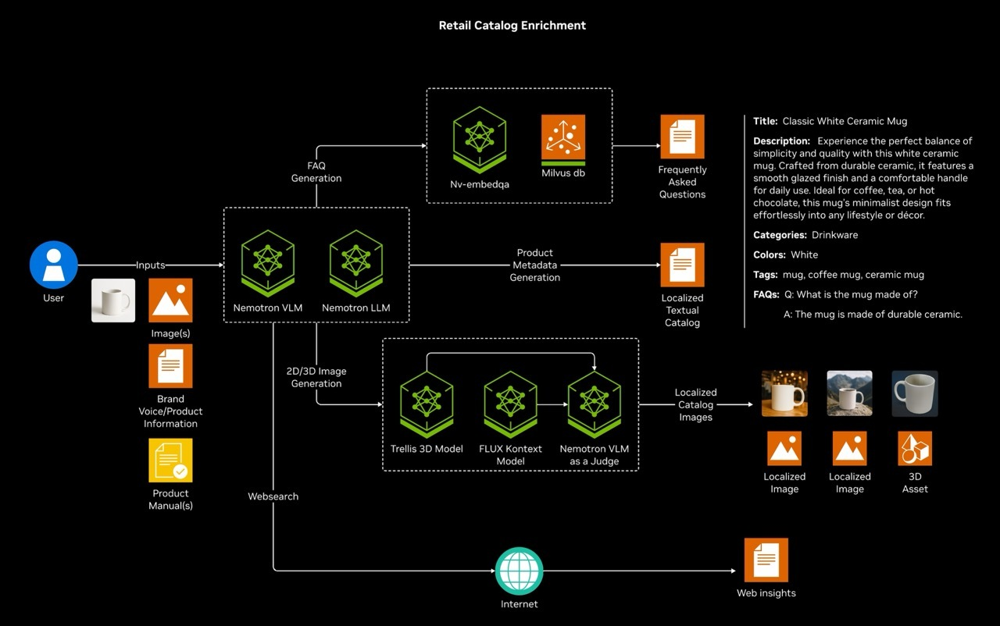

# Retail Catalog Enrichment Blueprint

<div align="center">


</div>

A GenAI-powered catalog enrichment system that transforms basic product images into comprehensive, rich catalog entries using NVIDIA's Nemotron VLM for content analysis, Nemotron LLM for intelligent prompt planning, FLUX Kontext model for generating high-quality product variations, and TRELLIS model for 3D asset generation.

## Demo

▶️ **[Watch the Demo Video](https://www.youtube.com/watch?v=VGXCQeRZELg)**

## Architecture



## Key Features

- **AI-Powered Analysis**: NVIDIA Nemotron VLM for intelligent product understanding
- **Smart Categorization**: Automatic classification into predefined product categories
- **Intelligent Prompt Planning**: Context-aware image variation planning based on regional aesthetics
- **Multi-Language Support**: Generate product titles and descriptions in **10 regional locales**
- **Cultural Image Generation**: Create culturally-appropriate product backgrounds (Spanish courtyards, Mexican family spaces, British formal settings)
- **Quality Evaluation**: Automated VLM-based quality assessment of generated images with detailed scoring
- **3D Asset Generation**: Transform 2D product images into interactive 3D GLB models using Microsoft TRELLIS
- **Modular API**: Separate endpoints for VLM analysis, image generation, and 3D asset generation

## Documentation

- **[API Documentation](docs/API.md)** - Detailed API endpoints, parameters, and examples
- **[Docker Deployment Guide](docs/DOCKER.md)** - Docker and Docker Compose setup instructions
- **[Product Requirements (PRD)](PRD.md)** - Product requirements and feature specifications
- **[AI Agent Guidelines](AGENTS.md)** - Instructions for AI assistants working on this project

## Tech Stack

**Backend:**
- FastAPI + Uvicorn (ASGI server)
- Python 3.11+
- OpenAI client (NVIDIA endpoint)
- PIL (Pillow) for image processing

**Frontend:**
- Next.js 15 with React 19
- TypeScript
- Kaizen UI (KUI) design system
- Model-viewer for 3D assets

**AI Models:**
- NVIDIA Nemotron VLM (vision-language model)
- NVIDIA Nemotron LLM (prompt planning)
- FLUX models (image generation)
- Microsoft TRELLIS (3D generation)

**Infrastructure:**
- Docker & Docker Compose
- NVIDIA NIM containers
- HuggingFace model hosting

## Minimum System Requirements

### Hardware Requirements

For self-hosting the NIM microservices locally, the following GPU requirements apply:

| Model | Purpose | Minimum GPU | Recommended GPU |
|-------|---------|-------------|-----------------|
| Nemotron-Nano-12B-V2-VL | Vision-Language Analysis | 1× A100 | 1× H100 |
| Nemotron-Nano-V3 | Prompt Planning (LLM) | 1× A100 | 1× H100 |
| FLUX Kontext Dev | Image Generation | 1× H100 | 1× H100 |
| Microsoft TRELLIS | 3D Asset Generation | 1× L40S | 1× L40S |

**Total recommended setup**: 3× H100 + 1× L40S (or 4× H100 for uniform configuration)

### Deployment Options

- Docker 28.0+
- Docker compose

## Quick Start

### Prerequisites

- Python 3.11+
- [`uv`](https://docs.astral.sh/uv/) package manager
- NVIDIA API key for VLM/LLM services
- HuggingFace token for FLUX image generation

### Environment Setup

Create a `.env` file in the project root:

```bash
NGC_API_KEY=your_nvidia_api_key_here
HF_TOKEN=your_huggingface_token_here
```

**Getting API Keys:**
- NVIDIA API Key: [Get one here](https://build.nvidia.com/)
- HuggingFace Token: [Get one here](https://huggingface.co/settings/tokens)

The FLUX.1-Kontext-Dev NIM uses a model that is for non-commercial use. Contact sales@blackforestlabs.ai for commercial terms.

Make sure you have accepted [https://huggingface.co/black-forest-labs/FLUX.1-Kontext-dev](https://huggingface.co/black-forest-labs/FLUX.1-Kontext-dev) and [https://huggingface.co/black-forest-labs/FLUX.1-Kontext-dev-onnx](https://huggingface.co/black-forest-labs/FLUX.1-Kontext-dev-onnx) License Agreements and Acceptable Use Policy, check if your HF token has correct permissions.

### Local Development (Without Docker)

1. **Install uv** (if not already installed):
   ```bash
   curl -LsSf https://astral.sh/uv/install.sh | sh
   ```

2. **Create and activate virtual environment**:
   ```bash
   uv venv .venv
   source .venv/bin/activate  # On Windows: .venv\Scripts\activate
   ```

3. **Install dependencies**:
   ```bash
   uv pip install -e .
   ```

4. **Configure NVIDIA NIM endpoints**:
   
   **IMPORTANT: Self-Hosted NIMs Required**
   
   For local development, you must self-host the following NVIDIA NIM containers:
   - **Nemotron VLM** (vision-language model)
   - **Nemotron LLM** (prompt planning)
   - **FLUX Kontext dev** (image generation)
   - **TRELLIS** (3D asset generation)
 
   Update the URLs in `shared/config/config.yaml` to point to your self-hosted NIM endpoints:
   
   ```yaml
   vlm:
     url: "http://localhost:8001/v1"  # Your VLM NIM endpoint
     model: "nvidia/nemotron-nano-12b-v2-vl"
   
   llm:
     url: "http://localhost:8002/v1"  # Your LLM NIM endpoint
     model: "nvidia/nemotron-nano-v3"
   
   flux:
     url: "http://localhost:8003/v1/infer"  # Your FLUX NIM endpoint
   
   trellis:
     url: "http://localhost:8004/v1/infer"  # Your TRELLIS NIM endpoint
   ```
   
   See the **[Docker Deployment Guide](docs/DOCKER.md)** for instructions on deploying these NIMs.

5. **Run the backend**:
   ```bash
   uvicorn --app-dir src backend.main:app --host 0.0.0.0 --port 8000 --reload
   ```

6. **Run the frontend** (optional):
   ```bash
   cd src/ui
   pnpm install
   pnpm dev
   ```

The frontend at `http://localhost:3000`.

### Docker Deployment (Self-Hosted NIMs)

The Docker deployment includes all required self-hosted NVIDIA NIM containers (Nemotron VLM, Nemotron LLM, FLUX, and TRELLIS). The `shared/config/config.yaml` is pre-configured with the correct service URLs for Docker networking.

For complete Docker deployment instructions, see the **[Docker Deployment Guide](docs/DOCKER.md)**.

**Quick Docker Start:**

1. **Create `.env` file** with required credentials:
   ```bash
   NGC_API_KEY=your_ngc_api_key_here
   HF_TOKEN=your_huggingface_token_here
   ```

2. **Create cache directories**:
   ```bash
   export LOCAL_NIM_CACHE=~/.cache/nim
   mkdir -p "$LOCAL_NIM_CACHE"
   chmod a+w "$LOCAL_NIM_CACHE"
   ```

3. **Start all services**:
   ```bash
   docker-compose up -d
   ```

4. **Access the application**:
   - Frontend: `http://localhost:3000`
   - Backend API: `http://localhost:8000`
   - Health Check: `http://localhost:8000/health`

## API Endpoints

The system provides three main endpoints:

- `POST /vlm/analyze` - Fast VLM/LLM analysis
- `POST /generate/variation` - Image generation with FLUX
- `POST /generate/3d` - 3D asset generation with TRELLIS

### Image Input Guidance

- **Recommended image size**: For best results, use product images that are ideally **500×500 pixels or higher** (JPEG or PNG).

For detailed API documentation with request/response examples, see **[API Documentation](docs/API.md)**.

## License

GOVERNING TERMS: The Blueprint scripts are governed by Apache License, Version 2.0, and enables use of separate open source and proprietary software governed by their respective licenses: [NVIDIA-Nemotron-Nano-12B-v2-VL](https://catalog.ngc.nvidia.com/orgs/nim/teams/nvidia/containers/nemotron-nano-12b-v2-vl?version=1), [Nemotron-Nano-V3](https://catalog.ngc.nvidia.com/orgs/nim/teams/nvidia/containers/nemotron-3-nano?version=1.7.0), [FLUX.1-Kontext-Dev](https://huggingface.co/black-forest-labs/FLUX.1-Kontext-dev/blob/main/LICENSE.md), and [Microsoft TRELLIS](https://catalog.ngc.nvidia.com/orgs/nim/teams/microsoft/containers/trellis?version=1).

ADDITIONAL INFORMATION: 
FLUX.1-Kontext-Dev license: [https://huggingface.co/black-forest-labs/FLUX.1-Kontext-dev/blob/main/LICENSE.md](https://huggingface.co/black-forest-labs/FLUX.1-Kontext-dev/blob/main/LICENSE.md).

Third-Party Community Consideration:
The FLUX Kontext model is not owned or developed by NVIDIA. This model has been developed and built to a third-party’s requirements for this application and use case; see link to: black-forest-labs/FLUX.1-Kontext-dev Model Card - [https://huggingface.co/black-forest-labs/FLUX.1-Kontext-dev](https://huggingface.co/black-forest-labs/FLUX.1-Kontext-dev).

This project will download and install additional third-party open source software projects. Review the license terms of these open source projects before use. 